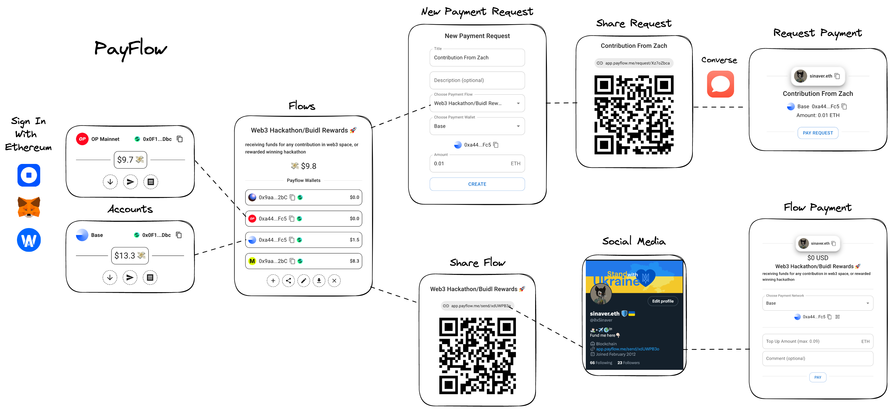

## **PayFlow**

**[PayFlow.me](https://app.payflow.me)** brings simplified crypto payment flows to Ethereum Layer 2, with secure Safe AA and gasless transactions



## 💡 **What is PayFlow for?**

Looking for a seamless way to manage multiple crypto payment flows?

Whether you’re a creator who wants to get supported by your fans, you’re raising funds for public goods, managing different incomes, or simply saving for some personal cause - YOU are ALL covered.

Your flow can receive payments on multiple L2 networks, you can attach an existing external wallet, or create a new one with Safe AA, and it’s gasless*.

If you need to receive a particular payment, you can create a trackable flow payment request.

Flows/requests can be shared simply as a link and QR code.

Simplify your payment flows with PayFlow!

## 🤔 **What inspired me to build PayFlow?**

1. One of the most famous online banking/fintech applications in Ukraine - **[Monobank](https://www.monobank.ua/?lang=en) - has a service called “Jar”**, you can create any virtual account to **collect money for any kind of purpose**. It became one of the most used features among Ukrainian volunteers.
2. I had the **intention to support one of the Web3 technical writers** (author of amazing articles about AA and blockchain interoperability), but after a brief discussion, it became obvious there are not many Web3 native funding/supporting/buymecoffee like platforms, where you can manage multiple streams of payments and share it over social media or embed in your website.
3. **Vitalik’s article**: [The Three Transitions](https://vitalik.ca/general/2023/06/09/three_transitions.html)

## ⚙️ **How does PayFlow work?**

1. Sign in with Ethereum
2. Create accounts for networks to support flow wallets
3. Create a flow
4. Add either external wallets or smart wallets (Safe AA) owned by accounts
5. Share the flow on social media and receive payments
6. Create a payment request for a particular flow, wallet, and amount
7. Share payment request
8. Once paid, verify the payment
9. Withdraw funds from flows to accounts
10. Transfer funds from accounts or for a broader spectrum of operations utilize Safe Apps ecosystem.

## ❤️ **What values does PayFlow stand for?**

- **Accessibility**: makes it possible for anyone to start receiving payments in crypto, regardless of their technical expertise or financial status. It empowers individuals, creators, and businesses in developing countries, where traditional financial services are often inaccessible.
- **Flexibility**: allows users to create multiple flows to collect payments for different purposes. It helps to streamline the payment process for individuals, creators, and businesses and makes it easier to track finances.
- **Permissionless**: accounts are only controlled by the user, users have complete ownership over their funds. It promotes financial freedom and self-sovereignty.
- **Multichain support**: flows can accept payments on multiple L2 networks, thus users have access to a wider range of liquidity and trading opportunities. It promotes financial inclusion and economic development.
- **Composability**: accounts are backed by Safe AA, at any point user can continue using them in Safe App, which also means that they can be used with other DeFi applications of the ecosystem. It creates new financial products and services that could benefit individuals and communities.
- **Gasless UX**: transactions are gasless, there is no initial barrier to receiving payments. It makes crypto payments more affordable and accessible to everyone.

## 👨🏻‍💻 **The team behind PayFlow**

It’s me for now - Sinaver - former Engineering Manager in the cybersecurity space, working before on end-to-end encryption solutions like Signal/ProtonMail, and now I am excited to build a cool product that will bring the next wave of consumers to Web3 space. You can reach me here:

Twitter: **0xSinaver**

Discord: **sinaver**

Converse: **sinaver.eth**

## ✅ **Current Status and Future Milestones**

It’s already live, try it out here: [https://app.payflow.me](https://app.payflow.me/)

I started working on the project last month through hackathons where I won in multiple tracks and categories:

1) [ZkSync BUIDLEra](https://app.buidlbox.io/zksync/zksync-buidlera/): [https://app.buidlbox.io/projects/payflow](https://app.buidlbox.io/projects/payflow) (July 3, 2023 → July 18, 2023)

🏅 **Argent - Buidl something awesome with AA**

**Features:**

1. ✅ Accounts: create/transfer
2. ✅ Flows: create/add wallet/delete/withdraw/share
3. ✅ Flow Payment: pay
4. ✅ ZkSync AA

2) [EthGlobal SuperHack](https://ethglobal.com/events/superhack): [https://ethglobal.com/showcase/payflow-3zvni](https://ethglobal.com/showcase/payflow-3zvni) (August 4, 2023 → August 18, 2023)

**🥈 Base - Best Consumer Product**

**🥈 Safe - Best Use**

🏆 **Mode - Prize Pool**

**Features:**

1. ✅ Requests: create/share/verify
2. ✅ Request Payment: pay
3. ✅ Safe AA Integration for Accounts & Wallets
4. ✅ Gasless Transactions with Gelato (sponsored for accounts/wallets creation + syncfee for transfers/withdrawals)
5. ✅ Social Login with Web3Auth
6. ✅ Sign In With Ethereum
7. ✅ Chainlink Price Feeds

3) Here I am at the Base Onchain Summer (August 20, 2023 → now):

**Near-term (~3 months) features:**

1. ✅ EIP1271
2. ✅ Gasless transactions for Base (Mainnet)
3. Flow wallet creation on withdrawal (multicall tx, gas paid by the received balance in the wallet)
4. USDC/USDT/DAI/EUROC support
5. Accounts/Flows transaction activity
6. Embeddable widgets & branding for websites (Flow Payment)

**Long-term (~6 months) features:**

1. Import existing Safe Accounts
2. Transaction sponsorship based on waitlist, activity, tasks
3. Shared flows ownership
4. Add extra flow credibility (vouched/endorsed/attested)
5. Accounts recovery
6. Flow created for someone, and claimed after

## 🧱 **Tech Stack:**

**DApp:**

Vite, React, MUI, Typescript, Wagmi/Viem, Web3Auth, Safe AA SDK, Gelato Relay SDK, SIWE - deployed to vercel

**Back-end:**

Spring Boot, MySql (Cloud SQL) - deployed to GCP via cloud run

**Smart-Contracts:**

A mix of deployed contracts for ZkSync AA, and existing safe contracts within Safe AA SDK (+ deployed to other networks not available)

## 🛠️ **CI/CD**

1. Building/Running Services (GCP)
    
    ```bash
    cd ./services/payflow-service
    
    # run service with local MySql or with GCP CloudSQL
    # CloudSQL credentials are picked up automatically via DefaultCredentialsProvider
    gradle bootRun | gradlew bootRun -Pgcp
    
    # building container image for cloud run 
    # via gradle with Paketo Buildpack
    PROJECT_ID=$(gcloud config get-value project)
    
    gradle bootBuildImage -Pgcp \
    --imageName=gcr.io/${PROJECT_ID}/api-payflow-service
    
    docker push gcr.io/${PROJECT_ID}/api-payflow-service
    
    gcloud run deploy api-payflow-service \
      --allow-unauthenticated \
      --image=gcr.io/${PROJECT_ID}/api-payflow-service \
    --min-instances=1 --max-instances=2 \
    --memory=1024Mi \
    --set-env-vars="SPRING_PROFILES_ACTIVE=gcp"
    
    # check service details
    gcloud run services describe api-payflow-service
    ```
    
2. Building/Running dApp (Vercel)
    
    ```bash
    cd ./app
    npm install; npm run dev
    ```
    
3. Building/Deploying Smart-Contracts
